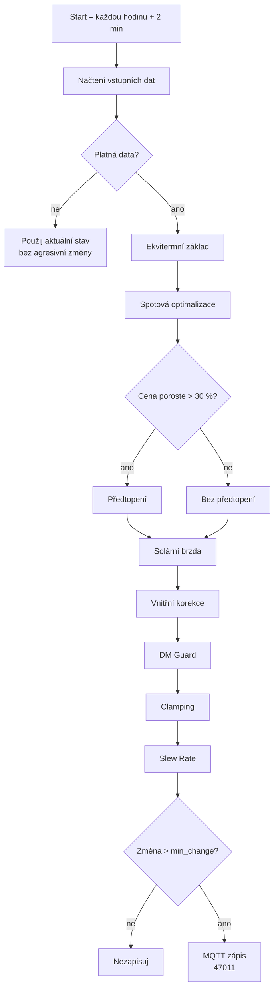

## 🧠 Jak automatizace funguje FINAL 

Tato automatizace funguje jako **centrální „mozek“ vytápění**.
Nedívá se pouze na jednu veličinu, ale **kombinuje ekonomiku, fyziku domu,
komfort uživatelů a ochranu samotného tepelného čerpadla**.

Cílem není maximalizovat výkon ani slepě šetřit,
ale **topit ve správný čas, správnou silou a bez zbytečného opotřebení**.

---

### 🔹 1️⃣ Ekvitermní základ (fyzika domu)

Základ řízení vychází z **venkovní teploty** (`outdoor_weather.temperature`).

- při poklesu venkovní teploty se automaticky zvyšuje základní offset
- při mírných teplotách se topný výkon přirozeně snižuje
- systém respektuje původní **ekvitermní filozofii NIBE**

To zajišťuje stabilní chování domu i při silných mrazech.

---

### 🔹 2️⃣ Spotová optimalizace (ekonomika)

Na ekvitermní základ je aplikována **spotová logika** podle aktuální ceny elektřiny
(`spot_price`):

- **levná elektřina** → zvýšení offsetu (akumulace tepla)
- **drahá elektřina** → snížení offsetu (útlum výkonu)

Dům je tak využíván jako **tepelný akumulátor** místo drahé elektřiny.

---

### 🔹 3️⃣ Předtopení – Look-ahead (predikce ceny)

Automatizace se **dívá cca 2 hodiny dopředu** do budoucích cen elektřiny.

- pokud vidí, že cena brzy vzroste o více než ~30 %
- a aktuální cena je stále relativně nízká
- aktivuje **předtopení**

Dům se „nabije“ teplem **ještě před zdražením**,
čímž se sníží nutnost topit v drahých hodinách.

Současně je implementována ochrana proti chybám dat
(výpadek nebo nekompletní cenová křivka).

---

### 🔹 4️⃣ Solární brzda (pasivní zisky)

Pokud aktuální stav počasí indikuje **jasno / slunečno**
v denních hodinách:

- automatizace **snižuje topný výkon**
- počítá s pasivními solárními zisky přes okna

Výsledkem je:
- méně přetápění
- lepší využití „energie zdarma“

---

### 🔹 5️⃣ Vnitřní korekce – zpětná vazba (komfort)

Automatizace neignoruje realitu uvnitř domu.

Sleduje **vnitřní teplotu** (`indoor_temp`) a porovnává ji s cílem:

- pokud je doma tepleji → offset se snižuje
- pokud je doma chladněji → offset se zvyšuje

Korekce:
- je zesílena pomocí **response gain**
- dlouhodobě posunuta pomocí **indoor bias**
- nikdy nepřebíjí fyziku domu ani ochranné limity

Komfort má vždy vyšší prioritu než slepé předtápění.

---

### 🔹 6️⃣ Ochrana stupňominut – DM Guard

Automatizace **neustále hlídá stupňominuty** (`degree_minutes`):

- při hlubokém poklesu (např. pod −500)
  - se omezuje rychlost zvyšování výkonu
- cílem je zabránit:
  - pádu k −700
  - sepnutí elektrické patrony

Tato ochrana výrazně přispívá k:
- lepšímu COP
- ochraně kompresoru
- delší životnosti systému

---

### 🔹 7️⃣ Plynulost změn – Slew Rate (mechanická ochrana)

Automatizace **nikdy nemění offset skokově**:

- maximální změna je omezená na cca ±1.0 za hodinu
- při kritických stavech ještě méně
- žádné náhlé skoky, žádné šoky

Tím se udržují:
- stabilní stupňominuty
- plynulý chod kompresoru
- klidné chování celé soustavy

---

### 🔹 8️⃣ Ochrana zápisů a transparentnost

Zápis do NIBE proběhne pouze tehdy, když:

- změna offsetu je větší než nastavený práh (`min_change`)
- HDO (pokud je použito) dovoluje provoz

Každý zásah je zároveň **logován přes MQTT** (`nibe/debug/offset_calc`),
což umožňuje:

- zpětnou analýzu
- ladění
- prokazování přínosu regulace

---

## 🧠 Shrnutí filozofie

> Tato automatizace netopí „víc“ ani „míň“.  
> Topí **chytře, plynule a s ohledem na budoucnost**.

Spojuje:
- fyziku domu  
- ekonomiku spotového trhu  
- komfort obyvatel  
- ochranu technologie  

a dělá to **bez hysterických zásahů a bez zbytečného opotřebení**.

---

## 📚 Dokumentace

Pro detailní informace prosím nahlédněte do následující dokumentace:

- **[FAQ](docs/FAQ.md)** - Často kladené otázky
- **[Architektura](docs/architecture.md)** - Přehled architektury systému
- **[Komunikace](docs/communication.md)** - Detaily MQTT a Modbus komunikace
- **[Diagramy](docs/diagrams.md)** - Diagramy systému
- **[Home Assistant](docs/home-assistant.md)** - Konfigurace Home Assistant
- **[NIBE / nibepi](docs/nibe-nibepi.md)** - Nastavení NIBE tepelného čerpadla a nibepi
- **[Dashboard](DASHBOARD.md)** - Nastavení a konfigurace dashboardu
- **[Helpery](Helpery.md)** - Pomocné entity a jejich použití

---

## 📋 Požadavky

- Tepelné čerpadlo NIBE (F-série)
- Home Assistant
- MQTT broker
- nibepi nebo kompatibilní Modbus-MQTT bridge
- Integrace spotových cen elektřiny
- Integrace počasí (např. Open-Meteo)
- Čidlo vnitřní teploty

---

## 🚀 Instalace

1. Nainstalujte automatizační blueprint v Home Assistantu
2. Nakonfigurujte požadované entity (spotová cena, počasí, senzory)
3. Nastavte helper entity (input_number helpery)
4. Nakonfigurujte MQTT témata pro váš nibepi/bridge
5. Upravte parametry podle charakteristik vašeho domu
6. Monitorujte a dolaďte po několik dní

---

## ⚖️ Licence

Tento projekt je licencován pod licencí MIT - viz soubor [LICENSE](LICENSE) pro detaily.

---

## 🙏 Poděkování

- NIBE za poskytnutí Modbus přístupu k tepelným čerpadlům
- [nibepi projekt](https://github.com/anerdins/nibepi) za MQTT-Modbus bridge
- Home Assistant komunita za integrace a podporu

