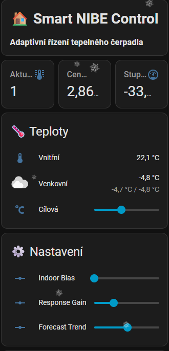
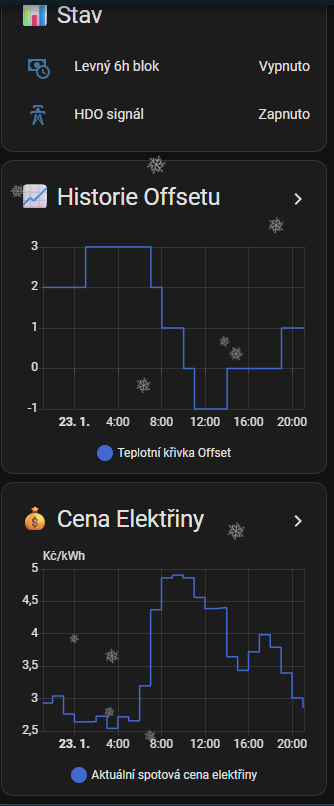

# 🏠 Smart NIBE Control – Adaptivní řízení tepelného čerpadla

[](CHANGELOG.md)
[](https://www.home-assistant.io/)
[](LICENSE)

Inteligentní blueprint pro Home Assistant, který adaptivně řídí tepelné čerpadlo NIBE prostřednictvím úpravy ekvitermní křivky (Modbus registr 47011). Systém **nepřepíná kompresor**, ale plynule optimalizuje tepelný výkon na základě 8 nezávislých vlivů.

---

## ✨ Co systém umí

| Složka | Popis |
|--------|-------|
| 🌡️ **Ekviterma** | Základní výpočet z venkovní teploty |
| ⚡ **Spot ceny** | Zvyšuje topení při levné elektřině, snižuje při drahé |
| 🏠 **Vnitřní teplota** | Koriguje offset podle odchylky od cílové teploty |
| ☀️ **Solární brzdění** | Omezuje topení v 9–15 h při slunečném počasí |
| 🔮 **Předehřev** | Zahřeje dům 1–8 h před zdražením elektřiny |
| 📊 **Stupňominuty** | Chrání kompresor a brání zapnutí bivalence |
| 🌤️ **Forecast bonus** | Reaguje na předpověď počasí (ochlazování/oteplování) |
| 🔧 **Plynulá změna** | Limituje skok offsetu na ±1 za hodinu |

---

## 🧮 Jak to počítá

Výsledný offset se skládá ze součtu všech složek:

```
offset = vliv_spot + vliv_ekvitermní + vliv_vnitřní × gain
       + bonus_6h_blok + preheat_bonus − solar_malus
       + forecast_bonus + cop_bonus
```

### Vliv spot cen (v4.4)
```
vliv_spot = (−0.3 × cena [Kč/kWh]) + 1.5
```

| Cena elektřiny | Vliv na offset |
|---------------|---------------|
| 2 Kč/kWh | **+0.9** (mírně zvyšuje topení) |
| 5 Kč/kWh | **0.0** (neutrální) |
| 10 Kč/kWh | **−1.5** (mírně snižuje) |

> 💡 **v4.4:** Vliv spot cen byl záměrně snížen 3× (dříve koef. −0.8/+4.0). Systém nyní dává přednost komfortu vnitřní teploty před agresivní optimalizací cen.

### Vnitřní teplotní korekce
```
temp_diff = vnitřní_teplota − (cílová_teplota + indoor_bias)
```
Korekce je nelineární (±0.3, ±0.7, ±1.5) a násobí se `indoor_response_gain`.

---

## 📋 Požadavky

- **Tepelné čerpadlo NIBE** (S-series, F-series s VVM 320/500)
- **Home Assistant** 2024.1+
- **MQTT broker** (Mosquitto)
- **nibepi bridge** nebo ekvivalent pro Modbus–MQTT
- **Spot ceny** – integrace např. Spotová cena CZ / Nordpool
- **Venkovní teplota** – senzor nebo meteo integrace
- **Vnitřní teplota** – senzor v obytném prostoru

---

## 🚀 Instalace

### 1. Import blueprintu
```
Nastavení → Automatizace → Blueprinty → Importovat blueprint
```
Zadej URL tohoto repozitáře nebo nahraj soubor `smart_nibe_control.yaml` ručně.

### 2. Vytvoř helpery (input_number)

| Helper | Min | Max | Krok | Doporučená hodnota |
|--------|-----|-----|------|--------------------|
| `input_number.indoor_bias` | −1.0 | 1.0 | 0.1 | **0.0** |
| `input_number.indoor_response_gain` | 0.5 | 1.5 | 0.1 | **1.5** |
| `input_number.weather_forecast_trend` | −10 | 10 | 0.1 | *(auto)* |
| `input_number.weather_forecast_avg_6h` | −30 | 20 | 0.1 | *(auto)* |

> ⚠️ `indoor_bias = 0.0` zajistí, že efektivní cílová teplota odpovídá nastavené hodnotě v termostatu. Záporné hodnoty způsobují pozdější reakci systému.

### 3. Nakonfiguruj automatizaci
Vytvoř novou automatizaci z blueprintu a přiřaď entity:
- Senzor venkovní teploty
- Senzor vnitřní teploty
- Senzor cílové teploty
- Senzor spot ceny elektřiny
- Senzor stupňominut NIBE
- Number entita tepelné křivky (např. `number.heat_offset_s1`)

### 4. Volitelné: Dashboard
Importuj připravené karty z [DASHBOARD.md](DASHBOARD.md).

---

## ⚙️ Klíčové parametry

| Parametr | Popis | Doporučení |
|----------|-------|------------|
| `indoor_bias` | Systematická korekce cílové teploty | 0.0 (žádná korekce) |
| `indoor_response_gain` | Citlivost korekce vnitřní teplotou | 1.5 (max) |
| `offset_min` / `offset_max` | Rozsah výsledného offsetu | −3 / +3 |
| `step_limit` | Max změna offsetu za hodinu | 1.0 |
| `dm_threshold` | Práh stupňominut pro ochranu | −400 |

---

## 📊 MQTT senzory (debug)

Blueprint automaticky publikuje diagnostiku:

```yaml
sensor.nibe_offset_debug      # JSON s detailem všech složek
sensor.nibe_vliv_spot_ceny    # Složka spot cen
sensor.nibe_vliv_vnitrni_korekce  # Složka vnitřní teploty
sensor.nibe_vliv_ekviterm     # Ekvitermní složka
sensor.nibe_offset_finalni    # Výsledný offset před zápisem
sensor.last_nibe_offset       # Naposledy zapsaný offset
```

---

## 🖼️ Screenshoty




---

## 📝 Changelog

### v4.4 (2026-03-02)
- **Vliv spot cen snížen 3×**: koeficient −0.8 → −0.3, offset +4.0 → +1.5
- Vnitřní teplota nyní dominuje regulaci
- Doporučení: `indoor_bias = 0.0`, `indoor_response_gain = 1.5`

### v4.3
- Přidán COP bonus (±0.8 dle účinnosti kompresoru)
- Vylepšen forecast bonus

### v4.0–v4.2
- Ekvitermní výpočet, solární brzdění, 6h blok levné elektřiny

Plný changelog → [CHANGELOG.md](CHANGELOG.md)

---

## 🤝 Poděkování

- [NIBE](https://www.nibe.eu/) – výrobce tepelných čerpadel
- [nibepi](https://github.com/anerdins/nibepi) – Modbus bridge
- [Home Assistant](https://www.home-assistant.io/) komunita

---

## 📄 Licence

MIT © [Samot89](https://github.com/Samot89)
